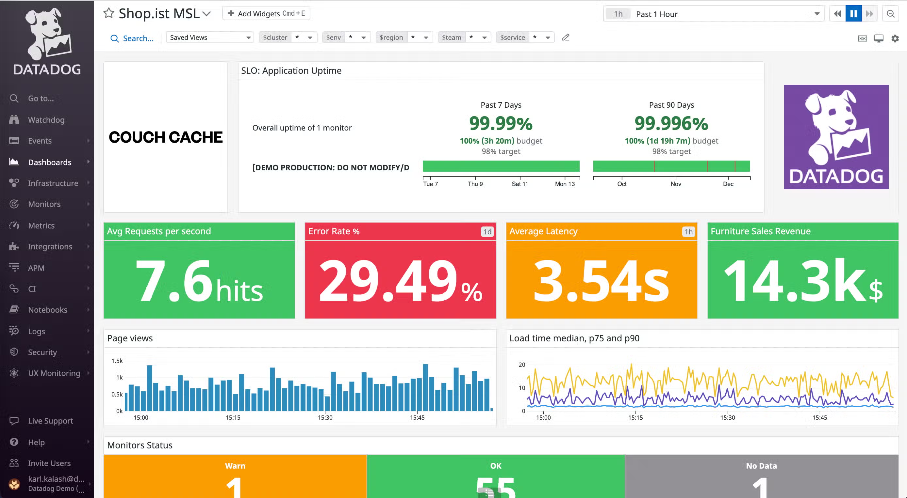

# 15 章 モニタリング

## 15.1　Kubernetes　における監視

Kubernetesでは複数のノードにまたがって大量のコンテナが起動している。`kubectl top`コマンドでメトリクスをかくにんすることができるが、クラスタ運用をしていくことは難しい。

本章では監視ツールとしてSaasの Datadog と Prometheus の２つを紹介する。

Datadog と Prometheus はそれぞれラベルとタグを使い自由な粒度で監視する対象をクエリすることができ、コンテナのスケーラビリティに伴うモニタリングの複雑性、運用負荷を抑制可能。

Prometheus は構築の手間があるが、費用はかからない。メトリクスを保存するサーバに多くのCPUやメモリなどのリソースが必要となる。

Datadog はメトリクスのデータは自身が管理するため運用コストは低くなる。しかし、ホストやコンテナごとに課金が発生するため金銭面のコストがかかる。

## 15.2　Datalog

Datadogは様々なミドルウェア、Saas、パブリッククラウドとの連携機能が用意されていて、時系列で様々なメトリクスを収集・可視化・モニタリング可能。

### 15.2.1 Datadog　のアーキテクチャ

デプロイ時にはDaemonsetを利用してDatadog Agentを各ノード上で起動する。
デプロイされたAgentは各ホストのCPU使用率やディスク使用率といったメトリクスの他に
各ノード上のコンテナのCPU使用率などのメトリクスも取得する。

DatadogをKubernetes上で連携して起動する場合にはコンテナにいくつかの環境変数を渡す必要がある。また、クラスタレベルのメトリクスを収集するコンポーネント（kube-state-metrics）を追加でインストールして連携することが推奨されている。
kube-state-metricsと連携することでDeploymentで起動しているPod数や要求起動数などのメトリクスを扱うことができる。他にもJobの成功数と失敗数やローリングアップデート時のPodの起動数の推移を監視することも可能。

### 15.2.2 Datadog　のインストール

Helm を使ってインストール可能。各種設定（認証情報等）を上書きすることでSaas側サーバに対してメトリクスを通信することができる。

### 15.2.3 Datadog のダッシュボード

ダッシュボードで各メトリクスを集約して確認できる。様々なミドルウェア用のプラグインとダッシュボードが用意されているので、有効化するだけで各ミドルウェアに特化したメトリクスを収集し、確認することができる。

> <https://www.datadoghq.com/ja/product/platform/dashboards/>

Datadogではhtopやctopから着想を得たライブコンテナモニタリングも行えるようになっている。各コンテナのCPU使用率/メモリ使用量/起動時間など2秒おきに送られてくるメトリクスをリアルタイムに可視化できる。

### 15.2.4 Datadogのメトリクス

コンテナに関するメトリクスはdocker.*, kubernetes.*, kubernetes_state.*の３種類がある。

| メトリクスキー | 概要 | 例 |
| --- | --- | --- |
| docker.* | Dockerコンテナに関するメトリクス | |
| kubernetes.* | kubernetesに関するメトリクス | kubernetes.cpu.requests(Podの要求CPU) |
| kubernetes_state.* | kubernetesクラスタレベルのメトリクス | kubernetes_state.deployment.replicas_unavailable(DeploymentのReadyではないPod数) |

### 15.2.5 より実践的な監視の例

### 15.2.6 Datadog によるコンテナの監視とアラートの設定

メトリクスをベースに監視設定とアラート設定を行うことができる。閾値ベースの発報はもちろん、より細かな監視設定もできる。
過去の状態と比較して異常を検知するAnomalyモニタリング、将来メトリクスが閾値を超えると予測するForecastモニタリング、グループ内で他のメンバと異なる動きをするOutlierモニタリングなどがある。

## 15.3 Prometheus

Prometheus はCNCFがホストしているオープンソースソフトウェアの監視ツール。

### 15.3.1 Prometheus　のアーキテクチャ

PrometheusはPrometheus Serverを中心に Alert Manager / Exporter / Push Gateway から構成されている。  

- Prometheus Server:メトリクスの収集と保存などを行うコンポーネント
  - データソースから収集するPull型アーキテクチャを採用し知恵るため、Server側がデータを取得しに行く形

- Exporter:各種のミドルウェアから監視項目のデータを抽出し、Serverからリクエストを受信した際にServerが理解できるフォーマットでレスポンスを返す
  - 公式サポートであるMySQL exporteやサードパーティ製のApache exporter などの多くのexporterが公開されている

- Push Gateway: Push型アーキテクチャでPrometheusにメトリクスを送るための仕組み
  - 実際には各プログラムからPush Gatewayにメトリクスを送信しておき、PrometheusがPush Gatewayからメトリクスを収集（Pull）する形で実装されている

Prometheus Serverがモニタリングの閾値を超えたと判断するとAlert Managerに対して発報のリクエストを送る。Alert Managerはその情報をもとにメール通知やSlack通知など様々な仕組みを用いて通知するようになっている。  

prometheusのデータの可視化にはgrafanaを利用するのが一般的。

### 15.3.2 Prometheusのインストール

PrometheusもHelmを使ってインストールすることが可能。Githubで公開されているPrometheus Operatorによるインストールでは様々な設定が組み込まれたマニフェストが使用できる。

### 15.3.3 大規模なPrometheusの運用を支えるエコシステム

Prometheusに蓄積されるメトリクスのデータ量の増加に伴うスケーラビリティの確保やマルチクラスタへの対応などを行うために、様々なプロダクトが開発されている。

- VictoriaMetrics
- Coretex
- Thanos

# 16 章 コンテナログの集約

## 16.1 コンテナ上のアプリケーションのログ出力

コンテナ上で起動するアプリケーションは基本的には標準出力と標準エラー出力にログを出力するようにしておくべきである。なぜならkubernetesでは標準出力と標準エラー出力に出力されたログを`kubectl logs`コマンドで表示できる仕組みになっているからである。

中長期的にログを安定保存するにはログを集約してクラスタ外部に転送することで後からいつでも利用できるようにしておくことが一般的。

他のログの運用方法

- アプリケーションが特定のファイルにログを書き出す
- アプリケーションからライブラリを使って直接外部に転送する

上記の方法では各アプリケーションごとに転送する仕組みを導入するため、設定の柔軟性が増す一方で管理コストが高くなる。また、`kubectl logs`コマンドでログを確認できない。

## 16.2 Fluentdによるログ集約

Kubernetes上で起動しているコンテナのログを中長期的に安定保存するためにはFluentdを使ってクラスタ外部に転送する構成がおすすめ。Fluentdもkubernetesと同様にCNCFがホストしているプロジェクトのひとつ。

Fluentdをkubernetesに組み込んで利用するにはDaemonsetを利用して各ノードにFluentdのPodを一つずつ起動する方法をとる。DaemonSetが作成する各ノードのFluentd Podは同じノード上に起動している全コンテナのログを取得して転送する。
